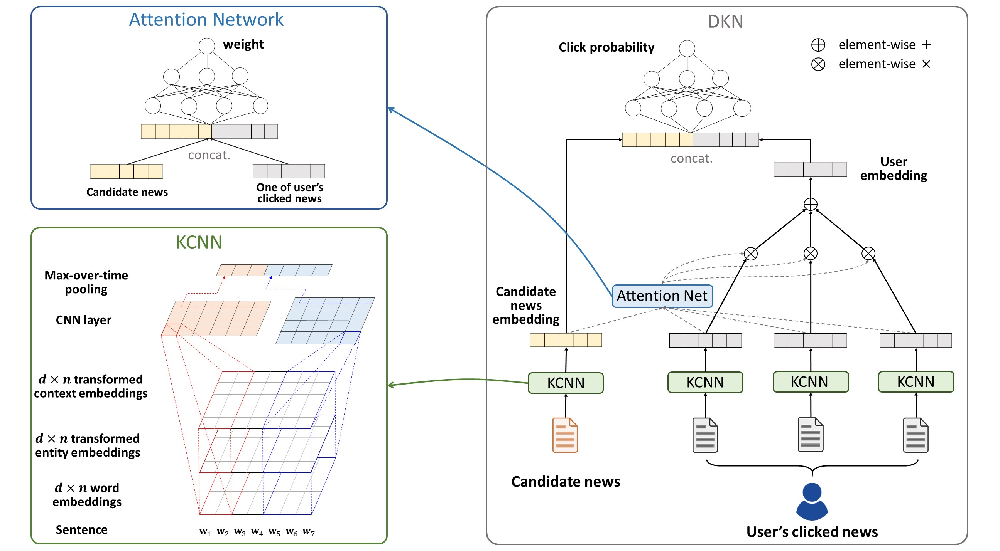

# DKN

在原本的

This repository is the implementation of [DKN](https://dl.acm.org/citation.cfm?id=3186175) ([arXiv](https://arxiv.org/abs/1801.08284)):
> DKN: Deep Knowledge-Aware Network for News Recommendation  
Hongwei Wang, Fuzheng Zhang, Xing Xie, Minyi Guo  
The Web Conference 2018 (WWW 2018)



- DKN 是一个深度知识感知网络，它利用新闻推荐中的知识图表示。DKN 中的主要组件是一个 KCNN 模块和一个注意力模块：
  - KCNN 模块是联合学习新闻的语义级和知识级表示。单词和实体的多通道和对齐使 KCNN 能够组合来自异构来源的信息。
  - 注意力模块是对用户的不同历史兴趣对当前候选新闻的不同影响进行建模


### Files in the folder

- `data/`
  - `kg/`
    - `Fast-TransX`: TransE 及其知识图嵌入扩展模型的有效实现（ (from https://github.com/thunlp/Fast-TransX);
    - `kg.txt`: 知识图谱;
    - `kg_preprocess.py`: 知识图谱预处理，输出DKN的知识嵌入文件;
    - `prepare_data_for_transx.py`: 为 Fast-TransX 生成所需的输入文件；
  - `news/`
    - `news_preprocess.py`: 预处理新闻数据集;
    - `raw_test.txt`: 原始测试数据集;
    - `raw_train.txt`: 原始训练数据集;
- `src/`:DKN实现

> Note: Due to the pricacy policies of Bing News and file size limits on Github, the released raw dataset and the knowledge graph in this repository is only a small sample of the original ones reported in the paper.


### Format of input files
- **raw_train.txt** and **raw_test.txt**:  
  `user_id[TAB]news_title[TAB]label[TAB]entity_info`  
  for each line, where `news_title` is a list of words `w1 w2 ... wn`, and `entity_info` is a list of pairs of entity id and entity name: `entity_id_1:entity_name;entity_id_2:entity_name...`
- **kg.txt**:  
  `head[TAB]relation[TAB]tail`  
  for each line, where `head` and `tail` are entity ids and `relation` is the relation id.


### Required packages
The code has been tested running under Python 3.6.5, with the following packages installed (along with their dependencies):
- tensorflow-gpu == 1.4.0
- numpy == 1.14.5
- sklearn == 0.19.1
- pandas == 0.23.0
- gensim == 3.5.0


### Running the code
```
$ cd data/news
$ python news_preprocess.py
$ cd ../kg
$ python prepare_data_for_transx.py
$ cd Fast-TransX/transE/ (note: you can also choose other KGE methods)
$ g++ transE.cpp -o transE -pthread -O3 -march=native
$ ./transE
$ cd ../..
$ python kg_preprocess.py
$ cd ../../src
$ python main.py (note: use -h to check optional arguments)
```
